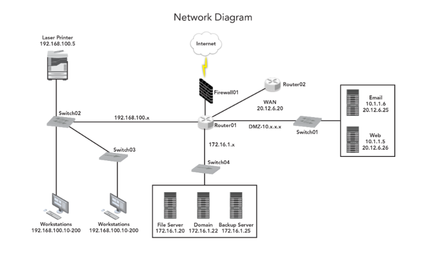

# Mod 3 Exercise Notes
---

## 3-1-2
---


Question 1  
Does Workgroup 1 have access to the Web Server (www in DMZ)?  
Yes!  

Question 2  
Does the Web Server in the DMZ have access to Workgroup 1?  
No!  

Question 3  
What is the purpose of Firewall B?  
To block all inbound traffic except for ports used by www, db, and email

Question 4  
What is the purpose of Firewall D?  
To block all inbound traffic  

Question 5  
A coworker in Workgroup 3 needs to send out an email to a coworker in Workgroup 1. What is the correct series of traffic network devices for this email to be sent and then received by the coworker?  
H, G, E, D, A, B, C, C, B, A, D, E, G


Question 6  
You are in Workgroup 1 and the following actions occur:

You connect to your internal SharePoint and download a document.
You email it to a coworker in Workgroup 2. (Assume coworker pulled email)
Your coworker proceeds to upload it to the webserver.

Follow the path of the network traffic that was created and count the number of hops. What is the total number of hops? (Hops include routers and endpoints.)

13 hops  

Question 7  
Does Workgroup 2 have access to Workgroup 3?  
Yes, the VPN connection between D and C allows access to Workgroup 3.  

Question 8  
Workgroup 1 and 2 want to create an FTP server and a database that both are allowed to access but would not allow access to Workgroup 3.  

What would be the best way to accomplish this?
Connect a firewall internal to G, connect a switch to that firewall, and connect the FTP server and database to the switch. (As the VPN connection would be coming inbound the firewall could block all inbound VPN traffic)  

Question 9   
By analyzing web traffic at Routers A and B, it is discovered that ransomware was attempted to be delivered by exploiting a vulnerability in version 1.0.2.8 Firewall OS. Firewall C had not been updated before the attack, but Firewall D was updated. Using the provided diagram, determine what workgroups could be affected by the attack.  
Only Workgroup 3 could be affected because the firewall D was updated.  

Question 10  
A Workgroup 1 user is downloading a file from Workgroup 3 with no issue, however, a user from Workgroup 3 is unable to download a file from Workgroup 1. Workgroup 1 is also not able to access the internet. What is most likely the issue?  
Workgroup 1 switch is misconfigured.


## 3-1-3 Develop Sensor Strategy - Placement of Sensors  
---
[Basic Network Device Logging](https://www.networkcomputing.com/networking/network-device-management-part-1-snmp-logging)  
[Learn about Netflow from Cisco Documentation](https://www.cisco.com/c/en/us/products/ios-nx-os-software/ios-netflow/index.html)  
[Network Traffic Logging](https://sansorg.egnyte.com/dl/v8yKo67ANC)  
[IDS and IPS deployment strategies](https://sansorg.egnyte.com/dl/pRVtSe53cF)  


Question 1  
What hardware device typically will NOT generate network logs?  
Hub

Question 2  
What type of data is usually NOT contained in a network log?  
Message content  

Question 3  
All communications from one network to another must travel through _________?  
a router  

Question 4  
An IDS analyzes traffic by comparing it with known _____________.  
event signatures  

Question 5  
What type of data is NOT captured in NetFlow monitoring?  
Packet payload  

Question 6  
A network tap will send a copy of a packet of data to the monitoring system but also will allow the packet to be sent to its destination.  
True  

Question 7  
Configuring a NIC to capture packets in promiscuous mode allows Wireshark to capture ____________.  
all packets it discovers, even if NOT addressed to the NIC  

Question 8  
Which combination of technologies is used to allow systems with private network addresses to communicate on the internet?  
PAT and NAT  

Question 9  
Which item listed below maintains a pool of IP addresses and automatically assigns an address to a machine when one is requested?  
DHCP  

Question 10  
Which issue must be addressed when planning to implement a physical tap?  
The installation of the tap will require a temporary break in the network connection.  


Question 11  
As the packet travels from Computer A to Computer B, what is the packet's source MAC address within Network 1?  
11:3D:35:99:43:FD  

Question 12  
As the packet travels from Computer A to Computer B, what is the destination MAC address as the packet leaves Router X?  
00:2B:11:32:FA:34  

Question 13  
As the packet travels from Computer A to Computer B, what is the source IP address as the packet leaves Router X?  
4.2.2.50  

Question 14  
As the packet travels from Computer A to Computer B, what is the destination IP address on the packet?  
32.54.1.21  

Question 15  
As the packet travels from Computer A to Computer B, what is the source MAC address on the packet after the packet has traversed Network 2 (while still inside Network 2)?  
00:00:01:55:3d:3f  
(need clarification on this - why does it change?)  

Question 16  
As the packet travels from Computer A to Computer B, what is the packet's destination MAC address after the packet traverses Network 2 (while still inside Network 2)?  
00:2b:11:32:FA:34  

Question 17  
As the packet travels from Computer A to Computer B, what is the source IP address on the packet when the packet is traversing Network 2?  
4.2.2.50  

Question 18  
As the packet travels from Computer A to Computer B, what is the destination IP address on the packet as it traverses Network 2?  
32.54.1.21  

Question 19  
As the packet travels from Computer A to Computer B, what is the source MAC address for the packet as it traverses Network 3?  
00:2b:11:32:43:23  

Question 20  
As the packet travels from Computer A to Computer B, what is the destination MAC address for the packet as it traverses Network 3?  
01:00:20:3F:FF:3D  

Question 21  
As the packet travels from Computer A to Computer B, what is the source IP address for the packet as it traverses Network 3?
4.2.2.50  

Question 22  
As the packet travels from Computer A to Computer B, what is the destination IP address for the packet as it traverses Network 3?  
32.54.1.21  


Question 23  
If a packet was traveling from Computer C to Computer B, what is the source IP address that Sniffer 2 will see?  
192.168.100.153  

Question 24  
If a packet was traveling from Computer C to Computer B, what destination IP address will be seen by Sniffer 2?  
20.1.23.5  

Question 25  
If a packet was traveling from Computer C to Computer B, what source IP address will be seen by Sniffer 1?  
192.168.100.153  

Question 26  
If a packet was traveling from Computer C to Computer B, what destination IP address will be seen by Sniffer 1?  
20.1.23.5  

Question 27  
If a packet was traveling from Computer A to Computer D, what source IP address will be seen by Sniffer 1?  
4.3.2.4  

Question 28  
If a packet was traveling from Computer A to Computer D, what destination IP address will be seen by Sniffer 1?  
66.94.234.13  

Question 29  
If a packet was traveling from Computer A to Computer D, what source IP address will be seen by Sniffer 3?  
4.3.2.4  

Question 30  
If a packet was traveling from Computer A to Computer D, what destination IP address will be seen by Sniffer 3?  
172.16.1.5  

  
  

### Scenario 1  
---
An internal workstation was identified as having accessed unauthorized documents on an internal file server on the network. The customer wants to monitor the workstation for anymore unauthorized activity.  

IP Address: 192.168.100.34  

MAC Address: 00:01:33:FA:B1:03  

Question 31  
List the possible locations for sensor placement and the problems or considerations at each location.  
Router 1 - Will see all traffic  
Switch 4 - will only monitor the servers  
switch 2 - will monitor all workstations  
 
Question 32  
Which filter would you place on the sniffer, an IP address or a MAC address? Why?  
IP address. Less volatile/not in flux  

Question 33  
Which ports/protocols would you use?  
Monitor for SMB/FTP/HTTP/TFTP

Question 34  
Based on what is provided, what other questions would you ask the network engineer or the system administrator?


### Scenario 2  
---
The customer has reported that their website has been defaced with anti-government material. The website is hosted on a server that is connected to the DMZ segment of the firewall. Reviewing the IIS logs, there are suspicious web requests from the IP address 214.3.152.67. It is suspected that the defacement came from that IP address. You are in charge of collecting data from the sensors and must decide from which sensors to collect data. Use the document and map provided to answer the following questions.  

Question 35  
What are the possible in-line sensors that you can collect data of value from that is related to the defacement?  
Firewall01 may have logs relating to the incident  

Question 36  
Are there any other sensors of interest? Why?  
No, there are no other sensors  

Question 37  
What additional questions would you ask the network engineer or system administrator?  


### Scenario 3
---
The customer states that a person is using a workstation on Switch 01 and is performing suspicious actions against the Victim Server on Switch 04.  

  

Question 38  
Using the local organic sensors, why is Switch 01 the best placement option?  
If the customer believes the suspicious activity is from Switch 01, tapping here will allow us to receive all traffic from the suspicious hosts.  

Question 39  
If it is determined that the subject has access to a remote VPN account, how does this change the answer for the best placement?  
If the malicious actor has remote access, tapping at Switch01 will no longer allow us to see the relevant traffic.

### Scenario 4
---
The subject is now an unknown attacker coming from the Internet. The arrow pointing to the firewall indicating a bad location is placed in both examples to emphasize that a CPT member should never try to place a network monitor directly into any firewall or router. In this example, both Switch 05 and Switch 03 are good locations to place a monitor.   
  

Question 40   
Why would Switch 05 be a better location to monitor than Switch 03? What could be some benefits of monitoring Switch 03?  
Switch05 will allow us to view all traffic coming into the network from the internet. A benefit of Switch03 is that the traffic will be a more narrow scope allowing us to fixate specifically on the traffic to the servers.  

### Scenario 5
---
An air traffic controller, using workstation 10.5.6.14, recently reported that her system may have been compromised. The user reported that she had been conducting research on the internet when she noticed her cursor acting in an erratic manner. After a few moments, a text file opened on the desktop and the following message was displayed: “You have been hacked!”  
  

Question 41  
Using the network map and the information provided, identify the IP address of the first witness device that may contain data pertaining to this incident.  
10.0.1.1

Question 42  
Using the network map and the information provided, identify the IP address of the second witness device that may contain data pertaining to this incident.  
10.0.1.3  

Question 43  
Using the network map and the information provided, identify the IP address of the third witness device that may contain data pertaining to this incident.  
10.0.1.14

Question 44  
Using the network map and the information provided, identify the IP address of the fourth witness device that may contain data pertaining to this incident.  
10.0.1.4


### Scenario 6
---
You received an alert that someone has been posting fighter maintenance records and images of fighters on a website for civilian military enthusiasts. You examined the images and determined they are pictures of aircraft assigned to Victorville Air Base. You visited the website and were able to verify that an air frame mechanic assigned to the fighter maintenance unit at Victorville Air Base uploaded the information. Upon further investigation, you found evidence of data being exfiltrated from both facility fighter sections. You have been assigned to collect network traffic to determine if any other data is being exfiltrated from the unit.  


Question 45  
Using the network map and the information provided, identify the IP address of the BEST location to install your network monitor.  
The internet side of the 692nd FTR Wing RTR


## 3-1-4 Develop Sensor Strategy - Place New Sensors and Reuse Local Resources
---
[Sensor Placement](http://www.mecs-press.org/ijisa/ijisa-v6-n2/IJISA-V6-N2-8.pdf)  
[Sensor Placement- SANS](https://sansorg.egnyte.com/dl/pRVtSe53cF)  

### Scenario 1: Ninety-Two Pines Marine Air Ground Base
---
The Equation Group hacking tools were leaked by third party Shadow Brokers. These hacking tools have been used to infect Windows machines worldwide. Yesterday, intelligence officials indicated that several government agency computers and servers have been infected, citing multiple reports of possible breaches targeting Windows 2KR2 Servers and Windows unpatched with remedies. As a result, an initial scan of network traffic and firewall logs (10.0.1.18) found that a host machine (10.57.4.3) is sending/receiving encrypted traffic to/from the 10.57.6.131 (server). Additionally, firewall logs from (10.0.1.18) indicate 445 traffic from the server IP to the host IP.  

Restrictions  
The supported commander does not want any network downtime.  

Simulated Equipment
- 1/10/100G in-line splitter
- 10 GB network tap
- 100/1000 copper Ethernet cables
- 1 x 24 port switch (auto sensing, 10/100/1000 Mbps, video-streaming capable)
- 1 x router
- Supported command's local resources


Question 1  
Private Hawker, located at Ninety-Two Pines Marine Air Ground Base, wants to either tap the router at 10.0.1.11 or reconfigure the IDS to do full capture. What are the pros and cons of each course of action?  
TAP router is off the table - customer does not want downtime. Adding a SPAN port on the router will get the job done. They already have a SPAN to the IDS - why can't we just plug in there?

About the full capture - works great, lives off the land. BUT requires loads of space.  


Question 2  
What is the purpose of capturing traffic on switch 10.0.1.10, since the packet from the host to the server does not ever transverse to that switch? Why do we want to see traffic from the external internet and internal devices?  
The C2 MUST be external


Question 3  
Private Hawker wants to know if tapping that port mirror/span port line between 10.0.1.10 and 10.0.1.14 will cause any network downtime. Would tapping that line cause network downtime? Why or Why not?  
Yes, tapping will cause network downtime


Question 4  
Private Hawker states that she wants to configure a span port on switch 10.57.4.2. Would this be a good idea? Why or Why not?  
No - we have limited taps and this is a waste

Question 5  
Private Hawker wants to configure a span port on switch 10.57.6.2. What information would this provide you as an analyst?  
This would provide traffic going to/from the servers


Question 6   
Private Hawker wants to use and configure the HBSS on the .3 host machine (local defender’s software) in order to monitor for threat activity. Why would it be important to use organic capabilities before we use our own?  
If we use our own tools, the threat actor may notice the change in the network  


Question 7  
Private Hawker wants to know why she has to monitor the network and make observations instead of immediately removing the malware from the host machine. Why is it important to monitor the network and make observations before containing and eradicating the malicious actor’s activity?  
You can only be sure the malware didn't replicate or the actor didn't move laterally if you watch the traffic. We need to monitor it. Triage it.    


### Scenario 2
---
The DCI intelligence analyst has found an intel report from NSA NTOC. The report suggests that a foreign cyber espionage organization has possibly compromised the Ninety-Two Pines Marine Air Ground Base classified network. The whole base is currently supporting a mission that requires 24-hour operations. The intelligence report is provided below, along with other guidance for this scenario.  

Question 8  
Private Hawker doesn't have any experience in a live network intrusion. Based on the information previously given, provide a sensor strategy describing the best location to place new sensors and which local resources will be re-purposed/configured.

Develop a sensor strategy describing the best location to place new sensors and which local resources will be re-purposed/configured in the space below. Your sensor strategy can be written below in any template or format you want. Pay special attention to the impact of your decisions. Thoroughly explain why you are making these changes in the sensor strategy.  


### Scenario 3
---
A new threat report issued by Mandiant Cyber Security Consulting Services | FireEye regarding new TTPs for APT1 was released today. According to Mandiant’s investigation, for the past five months, APT1 has gained access and compromised several DoD organizations. During the last two months, APT1 has been observed stealing 10.5 GB of compressed data from several technology- and DoD-contracting companies that support the U. S. Military Weapons Program. This also includes APT1’s compromise of PROJECT REAPER networks, which includes emails and sensitive documents for the U.S. Long Range Stealth Strike Bomber (LRSS-B) and U.S. Navy Advanced Attack Submarine SSN(X).  

As a result, several Cyber Protection teams have been ordered to ensure all critical infrastructure assets are protected, and to search for APT1 IOCs on the network. The supported command has provided a network map with their mission critical assets highlighted in RED. The CTE team has provided an APT1-specific attack diagram with the most likely course of action.  

Question 9  
Using the map and based on the COA 1 in the attack diagram provided by the CTE team, what is the best sensor placement position, if your team only has two network sensors? Why?  


Question 10  
Using the same resources, what is the best sensor placement position if your team only has one network sensor? Why?  


Question 11  
Using the same resources, what is the best sensor placement position, if your team only has one network sensor and two host sensors? Why?  


## Scenario 3-1-5: Receive and Process Baseline System Image
---

[Volatility Command Reference](https://github.com/volatilityfoundation/volatility/wiki/Command-Reference)  
[Sysinternal's Handler](https://learn.microsoft.com/en-us/sysinternals/downloads/handle)  

In this exercise, we will be comparing two system images. One live, and one baseline.  

Question 1  
Which of the following files in c:\windows\system32 have been manipulated on the livesystem capture file, compared to the baseline capture file? (Select all that apply.)  
Runonce.exe  
GRR.exe  

Question 2  
Putty was in the original baseline system image, but this owner decided to delete Putty.exe. What were the last 4 characters of the SHA1 hash?  
3b1333f826e5fe36395042fe0f1b895f4a373f1b

Question 3  
Are there any new users on the live system image compared to the baseline? If yes, list them here (separated by commas if more than one).  
dciadmin (apparently, I didn't see this)  
Windows > System32 > SAM / SECURITY > Export File  

You can now use RegView to open these files, which will allow you to expand and view the trees.  

Question 4  
Extract the registry files from the livesystem image hard drive. Are there any new run key entries that don't match the baseline? If yes, what are the paths to the binary referenced by them?  
Users > Export NTUSER.DAT file (contains HKU)   

Question 5  
What is the correct volatility profile to use on this image?   
Win10x64_14393  
(Identified by stopping Volatility a bit into its run on the image)  


Question 6  
Which of the following processes on the current machine has the same PID as the baseline?  
System  

`volatility.exe -f 'F:\mem.mem --profile win10x64_14393 imageinfo`  
`volatility.exe -f 'F:\mem.mem --profile win10x64_14393 pslist`  
`volatility.exe -f 'F:\mem.mem --profile win10x64_14393 netscan`  
`volatility.exe -f 'F:\mem.mem --profile win10x64_14393 mutantscan --silent`  
`volatility.exe -f 'F:\mem.mem --profile win10x64_14393 -p PID handles -t  mutant`  
`volatility.exe -f 'F:\mem.mem --profile win10x64_14393 filescan`  

Question 7  
Are there any new suspicious processes on the live system mem dump that don't match the baseline?  
nc64.exe , ac64.exe  

Question 8  
What is the mutant of the first abnormal process, alphabetically?  
Note: Use volatility muntantscan on the live meme dump.  
crazy123  

Question 9  
Are there any processes on the current machine listening on UDP that were not in the baseline? If yes, what is the name of the process?   
nc64.exe  

Question 10  
Using the first abnormal process (alphabetically), what is the absolute path to the process?   
Program Files (x86)\Google\av64.exe

Question 11  
Using the second abnormal process (alphabetically), what is the absolute path to the process?  
Users\DCI Student\Desktop\Exercise\config\nc64.exe


## Exercise 3-2-6 Perform Nmap Scan for Endpoint Identification  
---
 [nmap Documentation](https://nmap.org)  
 [nmap cheat sheet](https://highon.coffee/blog/nmap-cheat-sheet/)  

Question 1  
Use Nmap to scan the endpoint 192.168.13.17. Which ports are open for the endpoint?  
None of the options are open?

Question 2  
The operating system for the majority of endpoints is ____________.   
Looks like Linux 3.10-3.13  

Question 3  
Based on the information about open ports, how would you classify the endpoints 192.168.13.19 and 192.168.13.20?  
Web servers (443/80 open)  

Question 4  
Based on the ports open, which of the following hosts is most likely a workstation?  
.10 and .11 don't exist, and the two remaining have identical ports opened.. so? Rule of thumb is to look at what has the least services running  


## Exercise 3-2-7 Developing Rudimentary Ping Scan
---
[Building a Ping Sweep with Powershell](https://petri.com/building-ping-sweep-tool-powershell/)  
[Add a Port Check to your Ping Sweep](https://petri.com/building-a-powershell-ping-sweep-tool-adding-a-port-check/)  
[Powershell Scripting Docs](https://web.archive.org/web/20190220192836/https://docs.microsoft.com/en-us/powershell/scripting/overview?view=powershell-5.1)  


Ping Sweep for net enumeration example:  
`1..20 | % {"10.10.10.$($_): $(Test-Connection -count 1 -comp 10.10.10.$($_) -quiet)"}`

```
$port = (443)
$network = “192.168.13.”
$range = 1..254
$ErrorActionPreference= ‘silentlycontinue’
$(Foreach ($add in $range)
{ $ip = “{0}.{1}” –F $network,$add
Write-Progress “Scanning Network” $ip -PercentComplete (($add/$range.Count)*100)
If(Test-Connection –BufferSize 32 –Count 1 –quiet –ComputerName $ip)
{ $socket = new-object System.Net.Sockets.TcpClient($ip, $port)
If($socket.Connected) { “$ip port $port open”
$socket.Close() }
else { “$ip port $port not open ” }
}
}) | Out-File C:\reports\portscan.csv
```

** note the "TcpClient" field in the script! Ensure to update when scanning for UDP ports!  

```
$ipRangeStart = "192.168.13.19"
$ipRangeEnd = "192.168.13.40"
$port = 1434

$ipRangeStartParts = $ipRangeStart.Split('.')
$ipRangeEndParts = $ipRangeEnd.Split('.')

for ($i = [int]$ipRangeStartParts[3]; $i -le [int]$ipRangeEndParts[3]; $i++) {
    $ipToCheck = "{0}.{1}.{2}.{3}" -f $ipRangeStartParts[0], $ipRangeStartParts[1], $ipRangeStartParts[2], $i
    $ipEndPoint = New-Object System.Net.IPEndPoint ([System.Net.IPAddress]::Parse($ipToCheck), $port)
    $tcpClient = New-Object System.Net.Sockets.TcpClient

    try {
        $tcpClient.Connect($ipEndPoint)
        Write-Host "Port $port is open on $ipToCheck"
    } catch {
        Write-Host "Port $port is closed on $ipToCheck"
    } finally {
        $tcpClient.Close()
    }
}
```


## Exercise 3.2.8 Perform Traffic Analysis using Wireshark

[Wireshark Display Filters](https://wiki.wireshark.org/DisplayFilters)  
[Wireshark User's Guide](https://www.wireshark.org/docs/wsug_html_chunked/)  

Question 1  
Based on Total Packets, what is the most talkative external/public IP address?  
8.28.16.201  
Identified by going to statistics -> endpoints -> IPv4  

Question 2  
Analyze traffic related to the most talkative external IP address. Based on your analysis of this traffic, what is the purpose of this host?  
Web Filter

Question 3  
Based on the number of packets sent and received, what is the least active external/public IP address in the traffic capture besides 204.79.197.254 and 211.149.241.70?   
13.107.255.14

Question 4  
Research the least active external IP address. Who is the owner of this IP?  
[Microsoft](https://whois.arin.net/rest/net/NET-13-64-0-0-1/pft?s=13.107.255.14)  

Question 5  
At about what relative time in minutes was there a huge spike in traffic?  
23  
statistics -> I/O Graph


Question 6  
Was an executable downloaded? Enter the name of the executable downloaded. If there is no evidence of an executable downloaded enter "No".  
frame contains exe  
pccleaner.exe  

Question 7  
Extract the executable from the previous question. What are the last four characters of the md5 hash for the executable?  
4965  

Question 8  
Analyze the traffic after the executable was downloaded. What URL is being beaconed out to?   
smilecare.com

Question 9  
Does the identified domain name match a known IOC for this threat?  
Yes

Question 10  
What is the IP address of the identified domain?  
66.77.206.85  

Question 11  
What is the interval of the beacon?  
60 seconds  


## Exercise 3-2-9 Analyze Obfuscated Traffic

[File Signatures](https://www.garykessler.net/library/file_sigs.html)  
[User Agent Strings](https://sansorg.egnyte.com/dl/pGWQkGIq5N)  
[Malware Obfuscation Approaches](https://www.malwarebytes.com/blog/news/2013/03/obfuscation-malwares-best-friend)
### Scenario

Analyzing network traffic is a critical skill for an intrusion analyst. While we've looked at network traffic from aggregate perspectives (netflow, network statistics by host, etc.), we have yet to conduct more in-depth analysis of network traffic. In this exercise, you will have the opportunity to use more advanced searching and extraction capabilities in Wireshark to analyze network traffic and the artifacts contained within.  

During this exercise, you will gain proficiency analyzing network traffic and web traffic to discover foretelling information and locate prescient artifacts, extract the specific artifact, and conduct follow-on analysis of the artifact.

Question 1  
Use Wireshark to analyze the provided pcap and extract the file yikr9jXET.jpg. Once you have identified and extracted the image, enter the validation code.  
frame contains yikr9jXET.jpg  
JpgImageFromWireshark

Question 2  
Use Wireshark to analyze the provided pcap and extract the PNG image file transferred over HTTP with an IP in the 68.85.0.0/16 network. Once you have identified and extracted the image, enter the validation code.  
Note: Even when files are misnamed you can often identify the file type by a file signature similar to how the Linux/UNIX utility libmagic works.  
ip.addr == 68.85.0.0/16  
q9Xik-rTnw.bin
PngBy5ignature  

Question 3  
Use Wireshark to identify the downloaded executable masquerading as a Windows update. What is the name of the file that was downloaded?  
Windows updates use a ".msu" file extension. By using frame contains .msu, we can identify this. This search leads us to a packet with a MZP - zipped. Containing UPX.  SUS  

### Scenario Update 1  
The local cyber defense capability received an intrusion detection system alert identifying an unknown User Agent string leaving the defended network.  
http.user_agent == "XXX"  

Question 4  
Analyze the traffic associated with the User Agent string "Mozilla/4.0 (compatible; MSIE 6.0; Windows NT 5.1; SV1; .NET CLR 1.0.1288)" provided by the local defenders.  
What do you suspect the client operating system is?  

Question 5  
Do you believe the impacted client has AntiVirus installed? If yes, what vendor?  

Question 6  
What value is used to uniquely identify the client?  


### Scenario 2
The network defenders were able to identify the malware running on the client and have restored the system to a known good state. Use what you learned from the command and control to identify other hosts that may be impacted by a similar strain of malware.  

Note: Malware may morph over time and take on new characteristics of methods of obfuscating information. You may want to learn more about obfuscation techniques commonly used by threat agents.


Question 7  
Find another command and control interaction likely attributed to the same malware. What is the version of the suspected malware running on the second client?  

Question 8  
The last command and control interaction by the malware refers to an additional IP address. What is that IP address? 

Question 9  
Is there any indication that communication with that IP address was successful?  


## Exercise 3-3-12 Analyze a Host to Identify Threat Activity  

The exercise says to use GRR, but GRR is busted on these VM's. Everything will isntead be done with powershell! Yippee!  

Remote 1  
172.16.12.5  
Administrator / DC3P@ssw0rd

Remote 2  
172.16.12.3  
Administrator / DC3P@ssw0rd

Question 1  
Use GRR to perform analysis on the first system. GRR has already been installed on the system in question and can be accessed through the web interface. You do not need to reconfigure the GRR Server for this exercise.  
Use GRR to perform analysis on Windows Remote 1 system. Which malicious binaries are found on the Windows system? (Select all that apply.)  
`Get-ChildItem -Path C:\ -Recurse -ErrorAction SilentlyContinue -Force | where name -in ("chr0me.exe","extension.exe", "FileHunter-Win32.exe", "server.pem")`  

extension.exe  
FileHunter-Win32.exe


Question 2  
Use GRR to perform analysis on the first system. GRR has already been installed on the system in question and can be accessed through the web interface. You do not need to reconfigure the GRR Server for this exercise.  
Use GRR to answer the following question. Based on the previous two malicious binaries, did they establish persistence within the registry?  

__No__  
Yes, in the HKLM Run Key  
Yes, in the HKCU Run Key  
Yes, in Borland\Delphi\Locales  


Question 3  
First System Analysis  
Use GRR to perform analysis on the first system. GRR has already been installed on the system in question and can be accessed through the web interface. You do not need to reconfigure the GRR Server for this exercise.   
Use GRR to retrieve the hashes of the two malicious binaries previously found. Using the hashes, classify the type of malware the binaries are.  \

`get-filehash c:\path`    

Note: Using VirusTotal to check for malicious files is not a best practice. Many adversaries monitor VirusTotal in order to see if their malicious activity has been detected.    

__Adware__  
APT1 Threat  
Keylogger  
Ransomware  


Question 4  
Second System Analysis  
Use PowerShell to perform analysis on the second system.  
The file System32baseline.txt is provided on the Windows Remote 2 Desktop. This file is a baseline of filenames and SHA-256 hashes for System32, which you will be comparing with the live system.  
On the remote machine, which malicious binaries are on the system? (Select all that apply.)  

`Get-ChildItem -Path C:\ -Recurse -ErrorAction SilentlyContinue -Force | where name -in ("extrac32.exe","excel2018.exe", "jackinthebox.exe", "sxstrace.exe")`  

__extrac32.exe__  
excel2017.exe  
__jackinthebox.exe__  
__sxstrace.exe__  


Question 5  
Second System Analysis  
Use PowerShell to perform analysis on the second system.  
The file System32baseline.txt is provided on the Windows Remote 2 Desktop. This file is a baseline of filenames and SHA-256 hashes for System32, which you will be comparing with the live system.   

Which files have been changed since the baseline was made?  

`Select-String -Pattern "Noise.dat" -Path "C:\Users\Student\Desktop\file.txt"`  
 
```
file.txt:2184:"SHA1","8BF0A8F366BF9DAF344DF4396F7A714642FFADAF","C:\Windows\System32\NOISE.DAT"
```
```
[172.16.12.3]: PS C:\Users\student\desktop> get-filehash -algorithm sha1 c:\windows\system32\noise.dat

Algorithm       Hash                                                                   Path
---------       ----                                                                   ----
SHA1            8BF0A8F366BF9DAF344DF4396F7A714642FFADAF                               C:\windows\system32\noise.dat
```
```
file.txt:2191:"SHA1","5BE67DAD56E33CDBD1C327948EE70D43E69ED106","C:\Windows\System32\notepad.exe"
file.txt:14507:"SHA1","97424EE3AEC05C6E6A0857D8387D0FFE5B6D1B88","C:\Windows\System32\en-US\notepad.exe.mui"
```
```
[172.16.12.3]: PS C:\Users\student\desktop> get-filehash -algorithm sha1 c:\windows\system32\notepad.exe

Algorithm       Hash                                                                   Path
---------       ----                                                                   ----
SHA1            5BE67DAD56E33CDBD1C327948EE70D43E69ED106                               C:\windows\system32\notepad.exe
```
```
[172.16.12.3]: PS C:\Users\student\desktop> get-filehash -algorithm sha1 c:\windows\system32\en-US\notepad.exe.mui

Algorithm       Hash                                                                   Path
---------       ----                                                                   ----
SHA1            97424EE3AEC05C6E6A0857D8387D0FFE5B6D1B88                               C:\windows\system32\en-US\not...
```


Noise.Dat  
recoverydisk.exe  
notepad.exe  
__None__


Question 6  
Second System Analysis  
Use PowerShell to perform analysis on the second system.  
The file System32baseline.txt is provided on the Windows Remote 2 Desktop. This file is a baseline of filenames and SHA-256 hashes for System32, which you will be comparing with the live system.   

Which file is in the baseline and in the System32 directory?  

`Select-String -Pattern "redisc.exe.mui" -Path "C:\Users\Student\Desktop\file.txt"`  

None of the are the answer. Yay busted exercise!  

recdisc.exe.mui  
systemrestore.exe  
drivers.inf  
recover.dat  

## Exercise 3-3-13 Analyze Hosts to Determine IOC Presence

[Service Controller Command](https://learn.microsoft.com/en-us/previous-versions/windows/it-pro/windows-xp/bb490995(v=technet.10)?redirectedfrom=MSDN)  
[Windows Automatic Startup Locations](https://www.ghacks.net/2016/06/04/windows-automatic-startup-locations/)
[Wireshark Display Filters](https://wiki.wireshark.org/DisplayFilters)  


Question 1  
List all domains that the host is connecting to that match the given IOCs. Provide your answer in alphabetical order with a space between each domain.  
deebeedesigns.ca firebirdonline.com thecrownsgolf.org  


Question 2  
Out of the following GET paths, which IOCs were requested? (Select all that apply.)  
`frame contains GET`  
`http.request.method == GET`  
Backsangho.jpg  
Images/device_index.asp  
__news/media/info.html__  
__SmartNav.jpg__  


Question 3  
What IP IOCs are present on the system according to a netstat output?  
Give your answer in ascending order, based on the first octet of the IP address, with spaces between addresses.  
Example answer: 10.5.3.1 73.2.1.2 135.2.66.7  

Note: IPs will not show up in Wireshark. Note again: IPs will not show up in Netstat. Use Wireshark.  

63.192.38.11 65.110.1.32 140.116.70.8  

Question 4  
Using either a terminal or regedit, find all registry registry key's that have matching IOCs. What are the executables referenced that match IOCs? Place your answer in alphabetical order with spaces between multiple answers.  
`get-item -path HKLM:\Software\Microsoft\Windows\CurrentVersion\Run`  
`get-item -path HKCU:\Software\Microsoft\Windows\CurrentVersion\Run`  


Question 5  
Find the service name that matches the IOC list. What is the binary path of the executable it references (including the executable itself)?  
Example answer: C:\path\to\bad.exe   
`get-service`  
`Get-CimInstance win32_service | where {$_Name -like "aec"} | select Name, DisplayName, PathName`  
`sc qc aec`  
GUI services interface to view executable.  


## Exercise 3-3-14 Analyze a Security Event Log  

`Get-EventLog -LogName Security -Newest 100`  
`Get-EventLog -LogName Security -InstanceID 4624 -Newest 100`  

Question 1  
Use the built-in Windows Event Viewer application to open Exercise 6.2-077-Security.evtx log file in the Resources Drive. Briefly review the contents of the log.  
What is the task category of the first logged event?  
Log Clear 

Question 2  
What time was the event log cleared?
(Provide times in UTC with the following format: HH:MM:SS)  
15:42:29  

Question 3  
How many events have the event ID 4624?  
28  

Question 4  
How many events have the event ID 4779?    
2  

Question 5  
Apply a filter for all the failed logon events recorded. What time did the earliest failed logon attempt occur?  
(Provide times in UTC with the following format: HH:MM:SS)  
16:17:44  

Question 6  
What was the logon type of the earliest failed logon attempt?  
2  

Question 7  
Is there a log event that indicates a password was changed? If so, what account had a password change?  
Guest

Question 8  
Using a low-privilege account and reassigning privileges to a higher-access security group is one method used by threat agents to escalate privileges.

Is there an event that indicates a user was added to a security group with greater authorization? What event ID recorded this privilege escalation?  
4732  

Question 9  
What user account was added to the Administrators group?  
Student  
Guest? RID 501?  
```
A member was added to a security-enabled local group.

Subject:
	Security ID:		S-1-5-21-3703730383-877294775-1087173964-1000
	Account Name:		student
	Account Domain:		WIN7TEST
	Logon ID:		0x14C048E

Member:
	Security ID:		S-1-5-21-3703730383-877294775-1087173964-501
	Account Name:		-

Group:
	Security ID:		BUILTIN\Administrators
	Group Name:		Administrators
	Group Domain:		Builtin

Additional Information:
	Privileges:		
```


Question 10  
What event ID is recorded in the log that does not relate to user accounts or groups?  
6281  

Question 11  
Based on the System Integrity event, what file may be corrupted?  
I3codeca.acm  

Question 12  
What is the I3codeca.acm file?  

Select one.  

__An unsigned audio codec__  
An outdated Windows NT dll still used in Windows 7  
An incorrectly signed Hardware Compatibility Module  
A core Windows Kernel component that cannot be signed  


## Exercise 3-3-15 Characterize a Suspicious File  

[Malwarebytes Window Portable Executable (PE) Analysis Tools](https://www.malwarebytes.com/blog/news/2014/05/five-pe-analysis-tools-worth-looking-at)  
[Structure of a Portable Executable (Graphic)](https://upload.wikimedia.org/wikipedia/commons/0/09/Portable_Executable_32_bit_Structure.png)  
[Structure of a Portable Executable](https://learn.microsoft.com/en-us/windows/win32/debug/pe-format?redirectedfrom=MSDN)  


Question 1  
What type of file are you analyzing?  

NOTE: Get the corresponding sample from the resources drive and copy to your VM’s desktop. You may use any tool within the Malware Tools folder located on the computer.  
.xex   

Question 2  
Does the file extension match the file type?  
No    

Question 3  
Is the file packed? If no, type “No.” If yes, what packer was used?  
yes - UPX was used. We can see this in the "hex" section of filealyzer.  

Question 4  
Calculate the MD5 of the compressed sample. What are the last 4 digits of the MD5?  
944207B205C5FA4162B31C34309EB1B0  

Question 5  
Unpack the sample with an appropriate unpacking utility. Calculate the MD5 of the decompressed sample.  
What are the last four characters of the MD5?  
Using the UPX tool in the malware analysis folder, we can load in the file and then decompress it using the GUI.  
CDFD211E3A0E017E8C69453A550E566B  

Question 6  
An executable is not a single file, but rather, has a series of different sections that each have a different role. The number of sections can be used to help fingerprint an executable.  
Note: A packer will produce an executable with a reduced number of sections. Identifying the number of sections in a compressed executable tells you something about the packer, but nothing about the underlying executable. How many sections does the unpacked executable have?  
Nine? That's what I'm seeing in the "PE Sections" section of FileAlyzer. can alsdo be read in the hex  

Question 7  
What is the target Operating System compatibility?   
winders  


Question 8  
Select an import upon which this executable depends.  
__DLLs__  
IAP  
IP Address  
UPX  
We can see this in "PE Imports". All of the files are dlls.  

Question 9  
Which imported DLLs primarily deal with establishing network communications?  
wsock32.dll  

Question 10  
The imports table in an executable articulates not only the DLL that is required, but also the specific functions within the DLL. Which functions in the executable could indicate malicious behavior?  


Question 11  
What is the signature of the file?  
Note: A portable executable has two signatures. The start of the file is often referred to as the "MZ Header." The portable executable (PE) portion of the file also has its own signature. Either will be accepted here.  
5A4D / 00004550  

Question 12  
What registry key entry is referenced in the executable that could indicate a method of persistence?  
For Feedback: Use the "strings" capability to identify text in the sample that may be of interest.  
`strings filename > file.txt`  
HKLM\Software\Microsoft\Windows\CurrentVersion\Run  

Question 13  
Are there any executables referenced in the strings that would warrant concern?  
Yes - build.exe , cleansweep.exe  

Question 14  
There are several other strings that provide information about the executable and its intended functions. What are some of these strings that are particularly interesting?  
Get Tick Count - gets system uptime. Can be used with sophisticated malware to check if it's running in a VM   

Question 15  
What types of activity do you believe may occur if this executable were run?  
Host enumeration, send data to command and control. Establish persistence via run keys.    

Question 16  
If you believe a system was impacted by this executable, what is a filesystem artifact you could analyze to confirm your suspicion?  
cleansweep.exe , build.exe , run key  

Question 17  
Use the VirusTotal.com website and check if this sample has been seen before. Use the following MD5 hash value: 944207B205C5FA4162B31C34309EB1B0.  

Use an AntiVirus vendor's website to read more about this specific sample. Record the URL here.    


## Exercise 3-3-16 Become Familiar with Executable Static Analysis

[Kris Kendall's presnetation of Practical Malware Analysis](https://www.blackhat.com/presentations/bh-dc-07/Kendall_McMillan/Paper/bh-dc-07-Kendall_McMillan-WP.pdf)  
[Malwarefox.com: Classes/types of malware](https://www.malwarefox.com/malware-types/)  


Question 1  
Calculate the MD5 hash value of the provided "xex" file. Enter the last four digits of the MD5.  
BB7425B82141A1C0F7D60E5106676BB1  

Question 2  
Use the SHA1 value of the "xex" file to search for a sample on VirusTotal.com:  
9dce39ac1bd36d877fdb0025ee88fdaff0627cdb  
What class of malware do most antivirus vendors classify this sample as?  
Trojan  

Question 3  
Use FileAlyzer to review the contents of the "xex" sample. Do you see anything that indicates this sample is packed? If no, type “No.”  
No. Aside from UPX, if you can read strings, it isn't packed. Hex > right click > scan for strings.  There will also be a UPX tab in Filealyzer if it's packed.    

Question 4  
Review the "xex" file's imports. Do any of the imports indicate what this sample does?  
msvcrt.dll - used for memory allocation, file i/o, exception handling  
kernel32.dll - kernel level dll. protected by the hardware.  
Creates files- copies file?  To what end?  

Question 5  
Are there any file references within the "xex" sample that would provide us an indicator of compromise to look for on other systems?  
Give a justification as to why this file reference is an indicator of compromise.  
Hex > Filenames.  

Question 6  
Are there any network-related references in the "xex" sample that could be useful as an indicator of compromise to search for network-based command and control?  
If yes, give the filename. If there are no file references, enter "No."  
Are there any IP or domain names?  These would be seen in strings if they existed.  

Question 7  
Turn your attention to the "dllxx" file now. Continue your static analysis of this file using the same approaches used for the "xex" sample file. Calculate the MD5 hash value of the provided "dllxx" file. Enter the last 4 digits of the MD5.  
290934C61DE9176AD682FFDD65F0A669

Question 8  
Use the SHA1 value of the "dllxx" file to search for a sample on VirusTotal.com:  
a4b35de71ca20fe776dc72d12fb2886736f43c22  
What class of malware do most antivirus vendors classify this sample as?  

Question 9  
Use FileAlyzer 2 to review the contents of the "dllxx" sample. Do you see anything that indicates this sample is packed?  
No  

Question 10  
Review the "dllxx" file's imports. Do any of the imports indicate what this sample does?   
Creates a process and mutex, opens mutex.  

Question 11  
Are there any file references within the "dllxx" sample that would provide us an indicator of compromise to look for on other systems? If there are no file references, enter "No."  
No(?)  

Question 12  
Are there any network-related references in the "dllxx" sample that could be useful as an indicator of compromise or to search for network-based command and control?  

If yes, give the remote IP address for the malware.  
If there are no network references, enter "No."  

## Exam  

All day affair. 8 hr time limit    
It gives us the kitchen sink, we SHOULD only need Win 10 and Kali.  
19 questions.  

Expectations:  
Q1-7 relate to a provided network map. Questions feature sensor placement based on COAs, choke points, and subnets. (Ex 3-1-3)  

Q8-11 relate to looking for files within a baseline. Opening image with FTK. Locate file, file size, hash, MAC times for said file. (Ex 3-1-5)

Q12 is about scanning. We can use nmap here. Identify what IPs are discovered that are absent from the provided network map.  (Ex 3-2-6) 

Q13 is traffic analysis. Look through pcap to identify domain names matching a given IOC list. 3 Domains. Instructor recommends tcpdump, no thanks! (Ex 3-2-8)     
`sudp tcpdump -n -t -r pcap.pcap udp > udp.txt`  
`sudo cat udp.txt | grep -a -f DomainsIOC.txt`  
Once you see the IOC domains, you can less the file and search for the domain to identify the IP address.  

Q14-15 relate to ports and services. Also using nmap. Identify what ports are open and associated services. We will find a port open that will NOT be on the baseline. Nmap may not properly identify the associated service. Google the port!  

** Nmap questions might be a bit difficult. IPs for fakenet have changed so it's a bit wonky.  

Outside of nmap and engaging with the fakenet, the IPs are valid.  

Q16-19 relate to system analysis. Using powershell to perform host analysis on a windows server and look for files. A batch file, a running process, a service, and an IOC located in system32.  (Ex 3-3-13)  
