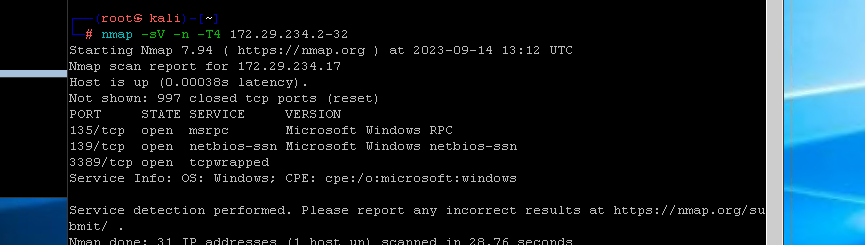
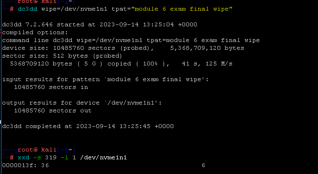

# Mod 4 Exercise Notes
---

## Exercise 4-1-1 Investigate a False Positive
---

Question 1  
What happens when the user runs the Google Chrome browser?

It opens directly to "youtu.be"  


Question 2  
The browser attempts to connect to what URL?  
youtu.be - more specifically, it rick rolls the user  


Question 3  
Was the target of the Google Chrome shortcut altered?  
Yes  
__No__ 


Question 4  
Identify the target of the Google Chrome shortcut and state where it is located.  

NOTE: Use the file path to state where it is located.
"C:\Program Files (x86)\Google\Chrome\Application\chrome.exe"


Question 5  
Does the hash of the chrome.exe match a known Chrome executable?  

Note: It is a bad practice to put hashes into VirusTotal. Adversaries are known to monitor the website in order to see if their malicious activity has been found. For this course, it is fine but you could also compare the hash file against your local machine!  
`get-filehash -a md5 "C:\Program Files (x86)\Google\Chrome\Application\chrome.exe`  
7D48976F85456176A02903B466C92CE4  
Yes   
No  

This hash is not recognized by virus total, and it doesn't match chrome.exe on my local machine.    

Question 6  
The user reported that the browser starts automatically after a reboot. Where would be the best places to look for artifacts?  
Registry run keys  

Question 7  
Is there a registry value associated with the suspicious executable? If so, what is it?
```
PS C:\Program Files (x86)\google\chrome\Application> Get-Item -path HKCU:\SOFTWARE\Microsoft\Windows\CurrentVersion\Ru


    Hive: HKEY_CURRENT_USER\SOFTWARE\Microsoft\Windows\CurrentVersion


Name                           Property
----                           --------
Run                            Google Chrome Updater : C:\Program Files (x86)\Google\Chrome\Application\chrome.exe
```

Question 8  
What is the value data?  

Question 9  
Is it likely that this incident indicates an APT1 actor?  
Yes, it is likely an APT.  
__No, it is not likely an APT.__  


Question 10  
Why do you think this is not a likely APT threat? What seems to be the cause of this incident?  
homie got PRANKED!  


## Exercise 4-1-2 Investigate a True Positive  

Question 1  
Identify if there are indicators of compromise in the registry.  
`Get-Item -path HKLM:\SOFTWARE\Microsoft\Windows\CurrentVersion\Run` 
I would say yes - sus values in run key.   

Question 2  
If you identified IOC's, what group of keys appears to be modified?  
```
PS C:\Users\DCI Student> Get-Item -path HKCU:\SOFTWARE\Microsoft\Windows\CurrentVersion\Run


    Hive: HKEY_CURRENT_USER\SOFTWARE\Microsoft\Windows\CurrentVersion


Name                           Property
----                           --------
Run                            OneDrive      : "C:\Users\DCI Student\AppData\Local\Microsoft\OneDrive\OneDrive.exe"
                               /background
                               MattIsAwesome : %LOCALAPPDATA%\MattIsAwesome.exe
                               LastEnum      : %LOCALAPPDATA%\Microsoft\VMwareManager.exe
                               ItunesHelper  : %TEMP%\ituneshelper.exe


```

Question 3  
List the values that may be IOC's.  

Note: Although all IOC’s are reportable, VMwareManager.exe and LastEnum are not the focus for this exercise.  
```
                               MattIsAwesome : %LOCALAPPDATA%\MattIsAwesome.exe
                               LastEnum      : %LOCALAPPDATA%\Microsoft\VMwareManager.exe
                               ItunesHelper  : %TEMP%\ituneshelper.exe
```

Question 4  
Identify any files that could be indicators of compromise. Include the absolute paths.  
```   
Directory: C:\Users\DCI Student\AppData\Local

Mode                LastWriteTime         Length Name
----                -------------         ------ ----
-a----       12/21/2017   4:02 AM        6999275 MattIsAwesome.exe


Directory: C:\Users\DCI Student\AppData\Local\Temp

Mode                LastWriteTime         Length Name
----                -------------         ------ ----
-a----       12/21/2017   4:02 AM        6999275 ituneshelper.exe

```

Question 5  
Is there evidence that ituneshelper could generate any network traffic? (Yes or No)  
Note: Use Select Strings in PowerShell with regex to filter out the IP Address.  
Yes  
No  
`.\strings.exe .\ituneshelper.exe | Select-String -Pattern "\d{1,3}(\.\d{1,3}){3}"`  

Question 6  
What is the private IP address the malware is trying to reach out to?  


Question 7  
Is this activity characteristic of APT1 activity?  

__Yes. The artifacts from this malware match the characteristics of APT1.__  
No. The artifacts from this malware do not match the characteristics of APT1.  


## Exercise 4-1-3 Analyze Network Traffic to Identify a Beacon  

Question 1  
What protocol contains a beacon that has a set interval between each beacon?  
__FTP__  
ICMP  
HTTP  
HTTPS  

IO Graph - filter for FTP. You can see a bit of a "heartbeat"  

Question 2  
What is the interval of the beacon in seconds?  
__60__  
30  
90  
120  


Question 3  
What is the IP address the beacon is reaching out to?  
66.220.9.50  

Question 4  
What percentage of the pcap is used by the packets between this beacon and the host machine?  
0.2%  
1.7%  
0.01%  
3%  


Question 5  
What protocol contains a beacon that has a random interval?  
ICMP  
FTP  
HTTP   
HTTPS  


Question 6  
What is the range of the randomness of the interval?  
2-10 minutes  
1-5 minutes  
1-2 minutes  
5-10 minutes  


Question 7  
What is the IP address the beacon is reaching out to?  


Question 8  
What is the Checksum of the first communication of the beacon? e.g., 0x284a  


Question 9  
What is the total packet length (in bytes) of each packet of this beacon? e.g., 15  
74 B

Question 10  
Which IOC is found but is not a beacon destination? e.g., domain.com  


Question 11  
What is the beacon IOC that is contained in the pcap? e.g., domain.com  
  
gobreach.com  
`Get-Content .\apturls.txt | ForEach-Object { select-string -path .\resolved_urls.txt -Pattern $_ }`  


Question 12  
What is the IP address associated with IOC beacon?  
gobroadreach.com  

Question 13  
What is the relative start time of the first beacon (rounded to the nearest second)?  
__174 seconds__  
74 seconds  
154 seconds  
15 seconds  


Question 14  
What is the interval of the beacon?  
5 minutes  
1 minute  
2 minutes  
10 minutes  


Question 15  
What is the length of the TCP beacon conversations (in KB)?  


Question 16  
How many packets are involved in the communication to this beacon?  


Question 17  
How many packets were sent to this beacon?  


Question 18  
In the whole recorded network activity, how many kilobytes were exchanged between the recording machine and the beacon?  
288 KB  

## Exercise 4-1-4 Deploy GRR Agent  
** Remote Deployment of GRR will be on the exam **

[GRR Rapid Response Documentation](https://grr-doc.readthedocs.io/en/latest/)  
[Windows Remote Management](https://learn.microsoft.com/en-us/windows/win32/winrm/portal?redirectedfrom=MSDN)  
[PSExec](https://learn.microsoft.com/en-us/sysinternals/downloads/psexec)  

__Scenario__  

Having completed collection activities with any datasets and capabilities that are native in the network, it is time to deploy CPT capability onto specific hosts. The threat in question has recently started using the wdboot.sys file for DLL hijacking, and you must verify this file has not been affected.  

__Action Summary__  

Deploy a GRR client to the Windows Server target using PowerShell.  
`1..100 | % {"172.16.12.$($_): $(Test-Connection -count 1 -comp 172.16.12.$($_) -quiet)"}`  
Ensure PS Remoting is enabled!  
`Set-NetConnectionProfile -NetworkCategory private`  
`Enable-PSRemoting`  
`winrm quickconfig`  
`Set-Item wsman:\localhost\client\trustedhosts -Value *`  

`Copy-Item -Path \\serverb\c$\programs\temp\test.txt -Destination \\servera\c$\programs\temp\test.txt;`  
Once the item has been transferred, we must execute it.  


`Enter-PSSession -UseSSL -ComputerName 172.16.12.6 -Credential Administrator`  
Verify you have deployed the GRR client by collecting information with flows.   
Answer questions pertaining to this exercise.   

```
$Session = New-PSSession -ComputerName "Server01" -Credential "Contoso\User01"   
Copy-Item "D:\Folder001\test.log" -Destination "C:\Folder001_Copy\" -ToSession $Session
```

Question 1  
What is the kernel version of the Windows Server Client?  

Note: If you are having trouble please re-read the introduction to understand what you should have already completed!  
"OS Version" on the clients page of GRR has this info.  

Question 2  
On the Server Client, what is the last four characters of the MD5 hash for the file wdboot.sys?  


Question 3  
On the Server Client, what is the size of the hosts file?  


Question 4  
On the Server Client, what is the only added username on the remote system?  

Note: If GRR doesn't work use PowerShell Net Users.  
hsolo  

## Exercise 4-1-5 Create a Powershell Script to Collect Data from Multiple Systems  

__Scenario__

Your team has been tasked with searching the network for given IOCs for Windows Machines. You have been given a subnet you are authorized to access and a network map. However, network maps can be outdated, so you will verify for yourself what machines are available on the network.  

Create a PowerShell script that determines machines on the network that can be connected to, and then gathers registry keys, files, and network locations based on given IOCs. Your script should then alert the user to what machines have matching IOCs, and what the matching IOCs are. Your area of operations is 10.10.10.0/24.  

[Invoke-Command](https://learn.microsoft.com/en-us/powershell/module/microsoft.powershell.core/invoke-command?view=powershell-5.1)  
[About Arrays](https://learn.microsoft.com/en-us/powershell/module/microsoft.powershell.core/about/about_arrays?view=powershell-5.1)  

Pseudocode -  
Scan net for active hosts.  
Apply live hosts into list.  
Enumerate list using invoke-command  

```
# 1..255 | % { $a = $_; 135 | % {echo ((new-object Net.Sockets.TcpClient).Connect("10.10.10.$a",$_)) "10.10.10.$a"} 2>$null}

$computers = "10.10.10.56","10.10.10.83","10.10.10.107"
$creds = Get-Credential
#echo $computers


Invoke-Command  -ComputerName $computers -ScriptBlock {get-date} -Credential $creds

```  

```
$port = 3389  
$network = "10.10.10"  
$range = 1..254  
$ErrorActionPreference= 'silentlycontinue'  
$(ForEach ($add in $range)
{ $ip = "{0}.{1}" -F $network.$add
write-progress "Scanning network" $ip -PercentCompelte (($add/$range.Count)*100)  
If(Test-Connection -BufferSize 32 -Count 1 -quiet -ComputerName $ip)  
{ $socket = new=object System.Net.Sockets.TcpClient($ip, $port)
If($socket.Connected) { "$ip port $port open"  
$socket.Close() }
}
Else { "$ip port $port not open " }  
})

```


Question 1  
List the File IOCs detected for each Host discovered.  
iexplore.exe, adobeupdater


Question 2  
What registry key value data matches the registry IOC list?  


Question 3  
What IP-based IOC finding is present on an end point?  


## Exercise 4-2-6 Identify Data Exfiltration Artifacts on a Windows System  

[List of File Signatures](https://en.wikipedia.org/wiki/List_of_file_signatures)  
[Alternate Data Streams](https://learn.microsoft.com/en-us/archive/blogs/askcore/alternate-data-streams-in-ntfs)  
[Check File Headers with PowerShell](http://learningpcs.blogspot.com/2012/07/powershell-v3-check-file-headers.html)  
[PowerShell Get-Content](https://learn.microsoft.com/en-us/powershell/module/microsoft.powershell.management/get-content?view=powershell-5.1)  
[Using Get-Content to Hex Dump a File](https://www.itprotoday.com/powershell/get-hex-dumps-files-powershell)  


__Scenario__

You are tracking down a series of indicators that may relate to data exfiltration. There are no additional tools authorized for deployment; however, the system you are analyzing has PowerShell.


__Action Summary__

Use documentation from the resources section as needed.
Collect information from a system using PowerShell and analyze the data in search of potential exfil data.  


__SCENARIO 1__

Within the user's document directory, there is a folder called exercise_8.  

Your first task is to write a PowerShell script to search for all files that have a .ZIP or .RAR extension in the C:\Documents\exercise_8 directory.  

`Get-ChildItem -Filter *.zip -Recurse -ErrorAction SilentlyContinue -Force | Measure-Object`  

Question 1  
How many files within that directory (and subdirectories) have either a .ZIP or .RAR extension?  
126 zip + 135 rar = 261  

__Scenario 2__

At a quick glance, these documents appear benign. However, threat actors have been known to use Alternate Data Streams (ADS) to hide files.  

Modify the previous PowerShell script or write another script to identify which files within the "Exercise 8" directory have an ADS.  

`Get-Item * -stream * | Where-Object {$_.stream -ne ':$DATA'}`  - this showed every stream for every file, including standard ones. to find ADS I just looked for ones that the stream name wasn't $DATA  
`Get-Content -Path c:\Documents\exercise_8\file.txt -stream nameofstream`  

YOU DIDN'T LOOK IN SUBDIRECTORIES YOU IDIOT  

Question 2   
How many files had an ADS?   

```
PSPath        : Microsoft.PowerShell.Core\FileSystem::C:\Users\DCI
                Student\Documents\exercise_8\sgtcpqbwzo\pqyuemditc.txt:teoycsrwul
PSParentPath  : Microsoft.PowerShell.Core\FileSystem::C:\Users\DCI Student\Documents\exercise_8\sgtcpqbwzo
PSChildName   : pqyuemditc.txt:teoycsrwul
PSDrive       : C
PSProvider    : Microsoft.PowerShell.Core\FileSystem
PSIsContainer : False
FileName      : C:\Users\DCI Student\Documents\exercise_8\sgtcpqbwzo\pqyuemditc.txt
Stream        : teoycsrwul
Length        : 384  
```
```
PS C:\Users\DCI Student\Documents\exercise_8\sgtcpqbwzo> get-content .\pqyuemditc.txt -stream teoycsrwul
PK   O†MKδ’Þ   a     ex8_pwdump.txt…Ð1N1…ቻØq;é(€ÙŽ#F‚ÝÕÎ,âøD[ÒPºð§_ïi|m§m?®zœ¯½ ôŒª‚b“ŠCp"ÁÈŽœ# ZGiu€4
Q"Y„ÏÄÍ“ƒ$ÓþPK?    O†MKδ’Þ   a   $               ex8_pwdump.txt
         <gáædDÓ;ûïW™CÓ3ÔèW™CÓPK      `

```


Question 3  
What are the names of the files that contain the ADS?  
ADS1:     
ADS2:   pqyuemditc.txt:teoycsrwul  
ADS3:   wfzardupoq.txt:mltjcfwgbx


Question 4  
What are the last 4 digits of the SHA1 for each file?  
ADS1:   
ADS2:   2DD188745678440424D8666E513E19FD6493C463  
ADS3:   


__Scenario 3__  

Extract the ADS into files and use PowerShell to determine the file signature of each file.   

Question 5  
What type of file was extracted from ADS1 (ibdlcsoznj.txt -> swogrxkcbh)?  


Question 6  
Are you able to access the content of the file extracted from ADS1?  
Yes  
__No__  


Question 7  
What type of file was extracted from ADS2 (pqyuemditc.txt - > teoycsrwul)?  
Zip file masquerading as a text file. I believe it to be ex8_pwdump.txt    

Question 8  
What was the content of the file extracted from ADS2?  


Question 9  
What type of file was extracted from ADS3?  


Question 10  
What was the content of the file extracted from ADS3?  


```
Get-Content ".\pqyuemditc.txt" -Encoding Byte `
  -ReadCount 16 | ForEach-Object {
  $output = ""
  foreach ( $byte in $_ ) {
#BEGIN CALLOUT A
    $output += "{0:X2} " -f $byte
#END CALLOUT A
  }
  $output
}
6F 73 65 70 6E 61 78 66 69 64 67 79 76 6C 72 0D
0A
```
```
PS C:\Users\DCI Student\Documents\exercise_8\sgtcpqbwzo> 
>> Get-Content ".\pqyuemditc.txt" -Encoding Byte `
>>   -ReadCount 16 -stream teoycsrwul | ForEach-Object {
>>   $output = ""
>>   foreach ( $byte in $_ ) {
>> #BEGIN CALLOUT A
>>     $output += "{0:X2} " -f $byte
>> #END CALLOUT A
>>   }
>>   $output
>> }
50 4B 03 04 14 00 00 00 08 00 4F 86 4D 4B CE B4
92 05 DE 00 00 00 61 01 00 00 0E 00 00 00 65 78
38 5F 70 77 64 75 6D 70 2E 74 78 74 85 D0 31 4E
04 31 0C 85 E1 1E 89 BB D8 71 12 3B E9 28 10 07
80 1E D9 8E 23 46 82 DD D5 CE 2C E2 F8 44 5B D2
50 BA F0 A7 5F EF 69 7C 6D A7 6D 3F AE 7A 9C AF
BD 00 F4 8C AA 82 62 05 93 8A 43 70 22 C1 C8 8E
  +  +   +   +   +   +   +   +   +   +   +  +
```
^ 50 4B is PK  

Question 11  
Another issue to consider is whether we missed any other ZIP or RAR files during our initial search. Modify your PowerShell searches to identify the file signature of all the files we have found, including those within an ADS. How many TXT files have a file signature that does not imply it is a text file?

15 files.

`Get-Content *.txt`  

## 4-2-7 Identify Keylogger Artifacts on a Windows System

__Scenario__

In this exercise, you will use Windows PowerShell to search for files that may have been created by a keylogger. PowerShell will prove useful, as most environments use Windows operating systems heavily. Students will also be using GRR to search for other log files that have been created by the suspected keylogger.

__Action Summary__

- Create a PowerShell script to search Windows systems for the keylogger tool used by APT1.
- Modify the PowerShell script to collect the log data associated with the keylogger.
- Use GRR to find files created around the time of the keylogger's creation date/time.
- Use GRR to collect registry keys created around the time of the keylogger's creation date/time.
- Record your findings.
- Answer questions within the exercise.

[PowerShell Get-Content](https://learn.microsoft.com/en-us/powershell/module/microsoft.powershell.management/get-content?view=powershell-5.1)   
[APT1 Documentation](https://malware.lu/assets/files/articles/RAP002_APT1_Technical_backstage.1.0.pdf)  
```
KeyX.exe 3d0760bbc1b8c0bc14e8510a66bf6d99 Keylogger, log in %APPDATA%/
teeamware.log
```
[GRR Documentation](https://grr-doc.readthedocs.io/en/latest/)  


Question 1  
Where was the currently running keylogger found on the system?  

NOTE: Base your answer on the name of the file, not the hash.  
Verify we are talking about KeyX.exe, the keylogger listed in the APT1 Docs, by running `Get-Process`  
`Get-ChildItem -Path C:\ -Filter KeyX.exe -Recurse -ErrorAction SilentlyContinue -Force`  
`Get-CimInstance -ClassName win32_process | where Name -like KeyX* | select *`  
```
PS C:\Users\DCI Student> get-childitem -path c:\ -filter KeyX.exe -recurse -erroraction silentlycontinue -force

    Directory: C:\Users\DCI Student\AppData\Local

Mode                LastWriteTime         Length Name
----                -------------         ------ ----
-a----         1/3/2018   6:06 PM        4738538 KeyX.exe

    Directory: C:\Windows

Mode                LastWriteTime         Length Name
----                -------------         ------ ----
-a----         1/3/2018   6:06 PM        4738538 KeyX.exe
```
Question 2  
What additional log file was created around the same time as teeamware.log?  
```
PS C:\Users\DCI Student> get-childitem -path c:\ -filter teeamware.log -recurse -erroraction silentlycontinue -force | select name,creationtime

Name          CreationTime
----          ------------
teeamware.log 1/3/2018 6:08:10 PM
```
`Get-ChildItem -path c:\ -recurse -erroraction silentlycontinue -filter *.log -force | select fullname,creationtime | Where-Object { $_.CreationTime -ge "1/2/2018" -and $_.CreationTime -le "1/4/2018" }`   
```
FullName                                                       CreationTime
--------                                                       ------------
C:\Users\DCI Student\AppData\Local\Microsoft\advkey.log        1/3/2018 6:08:10 PM
C:\Users\DCI Student\AppData\Roaming\teeamware.log             1/3/2018 6:08:10 PM
```


Question 3  
Using full path, where was the additional log file from Question 2 located on the system?   
__C:\Users\DCI Student\AppData\Local\Microsoft\advkey.log__

Question 4  
What is the value name of the entry found in the associated registry run key?
`Get-Item -path HKLM:\SOFTWARE\Microsoft\Windows\CurrentVersion\Run`  

```
PS C:\Users\DCI Student> Get-Item -path HKCU:\SOFTWARE\Microsoft\Windows\CurrentVersion\Run

    Hive: HKEY_CURRENT_USER\SOFTWARE\Microsoft\Windows\CurrentVersion

Name                           Property
----                           --------
Run                            OneDrive        : "C:\Users\DCI Student\AppData\Local\Microsoft\OneDrive\OneDrive.exe" /background
                               Keyboard Driver : C:\Windows\KeyX.exe
```
